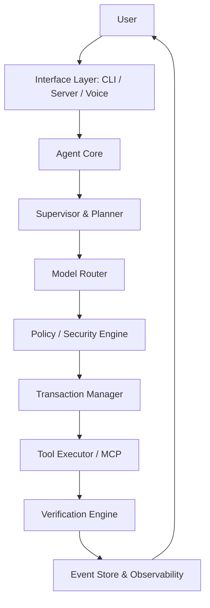

# Agent Platform Architecture

## Canonical Execution Flow

The core of the platform is designed around strict, bounded autonomy. The flow is as follows:

## Subsystems

1. **Agent Core**: Orchestrates interaction and maintains local session context.
2. **Supervisor**: Manages multi-agent parallel execution for complex goals.
3. **World Model**: Long-term state modeling and automated drift detection.
4. **Security Engine**: A Zero-Trust boundary that intercepts all intents and enforces Data Classification and Sandbox Profiles.
5. **Transaction Manager**: Provides rollback and crash recovery guarantees using an append-only Event Store.
6. **Observability**: Real-time SLA tracking, Bottleneck detection, and Resource Forecasting.
7. **Federation**: A secure identity and delegation protocol for Agent-to-Agent collaboration.

## Data Flow & State Management

State is persisted exclusively via the **Event Store** (`src/runtime/events.ts`). The `RuntimeReconciler` rebuilds `Projections` upon startup to ensure consistent resumption across crashes or intentional maintenance restarts.
