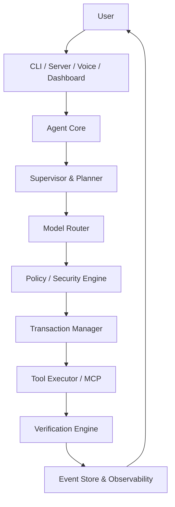

# 📋 Project Summary — Rose AI Agent Platform

## 🎯 Project
**Rose** (`rose-ai`) — a general-purpose, local-first AI agent platform with tools,
memory, automation, research, multi-agent orchestration and Gemini Live voice.

- **Version**: 1.1.3 · **Language**: TypeScript · **Runtime**: Node.js ≥ 18
- **Installable CLI**: `rose` (published as an npm package)

---

## ✨ What Rose Can Do

| Area | Highlights |
|---|---|
| **Interfaces** | Terminal CLI, headless REST server, React web dashboard |
| **Models** | Gemini, Claude, GPT via Model Router (+ Antigravity local proxy) |
| **Voice** | Gemini Live real-time A2A, 5 voices, mic recording (ffmpeg) |
| **Tools** | memory, web search, fetch page, terminal commands, GitHub/Calendar/Email |
| **Multi-agent** | Supervisor + 7 specialist sub-agents running in parallel |
| **Goals** | Planner → executor loop for long-horizon tasks |
| **Security** | Zero-trust Policy-as-Code engine, sandboxing, destructive-action simulation |
| **Reliability** | Event sourcing, transactions with rollback, crash recovery |
| **Simulation** | Dry-run actions against a world model before executing |
| **Observability** | Metrics, SLOs/error budgets, cost tracking, bottlenecks, capacity forecast |
| **Federation** | Secure agent-to-agent delegation across trust domains |
| **Learning** | Persistent memory: failures, feedback, preferences, strategies |
| **Skills** | Auto-discovered SKILL.md folders (coding, communication, productivity, system, terminal) |
| **Automation** | Cron-scheduled agent jobs |
| **Extensibility** | MCP servers, custom extensions |

---

## 🚀 How to Use

### Quick Start
```bash
# 1. Install dependencies
npm install

# 2. Configure providers (at least one)
cp .env.example .env
#    GEMINI_API_KEY=...        (or ANTHROPIC_API_KEY / OPENAI_API_KEY / proxy)

# 3. Run the interactive CLI
npm run dev

#    ...or run as headless server + dashboard
npm run dev -- --server
```

First-time provider setup wizard:
```bash
npm run dev -- setup     # see src/setup.ts
```

---

## 🏗️ Architecture (30-phase build)



State persists exclusively via the append-only **Event Store**
(`src/runtime/events.ts`); projections are rebuilt on startup so sessions survive
crashes and restarts. See [ARCHITECTURE.md](ARCHITECTURE.md).

---

## 📂 Project Structure

```
Rose/
├── src/
│   ├── index.ts            # Main app: REPL, voice session, command router
│   ├── cli.ts              # `rose` bin entry
│   ├── server.ts           # Express REST API (--server mode)
│   ├── agents.ts           # Supervisor + 7 specialist sub-agents
│   ├── router.ts           # Multi-provider model routing
│   ├── tools.ts            # Built-in tool registry
│   ├── capabilities.ts     # Capability detection/routing
│   ├── skills.ts           # SKILL.md discovery & registry
│   ├── memory.ts           # Persistent memory
│   ├── learning.ts         # Self-improvement loops
│   ├── automation.ts       # Cron scheduling
│   ├── research.ts         # Deep research pipeline
│   ├── security.ts         # Zero-trust enforcement
│   ├── transaction.ts      # Rollback/reconciliation
│   ├── mcp.ts / extensions.ts
│   ├── federation/         # A2A identity, trust, delegation
│   ├── goals/              # Planner + execution loop
│   ├── maintenance/        # Self-maintenance scanner/planner/verifier
│   ├── observability/      # Metrics, SLO, cost, health, alerts
│   ├── policy/             # Policy-as-code engine
│   ├── rca/                # Root cause analysis
│   ├── reliability/        # Chaos lab, invariants, scenarios
│   ├── runtime/            # Event store, projections, recovery
│   ├── simulation/         # Action dry-running
│   ├── world/              # World model + observer
│   └── testing/e2e.ts      # End-to-end tests (npm run test:e2e)
├── ui/                     # React + Vite dashboard (Chat/Overview/Settings)
├── skills/                 # Auto-discovered skill folders
├── memory/ , learning/     # Persisted memory stores
└── obsidian_vault/ , data/, logs/
```

---

## 📦 Key Dependencies

| Package | Purpose |
|---|---|
| `@google/generative-ai` | Gemini SDK |
| `ws` | Gemini Live WebSocket |
| `express` + `cors` | REST server |
| `@modelcontextprotocol/sdk` | MCP support |
| `node-cron` | Scheduled automations |
| `screenshot-desktop` | Screen awareness |
| `chalk`, `ora`, `@inquirer/prompts` | Terminal UX |
| `zod` | Schema validation |

---

## 🧪 Testing

```bash
npm run test:e2e    # end-to-end suite
```
Standalone scenario scripts also exist at repo root (`test-maintenance.ts`,
`test-rca.ts`, `test-reliability.ts`, `test-sim.ts`).

---

## 📚 Documentation Map

| Doc | Contents |
|---|---|
| [README.md](README.md) | Overview & startup modes |
| [FEATURES.md](FEATURES.md) | Complete feature list + CLI reference |
| [ARCHITECTURE.md](ARCHITECTURE.md) | Execution flow & subsystems |
| [SECURITY.md](SECURITY.md) | Zero-trust model |
| [QUICK_START.md](QUICK_START.md) | Setup guide |
| [UPDATES.md](UPDATES.md) | Changelog |

---

## 🔐 Security Notes

- API keys live only in `.env` (git-ignored)
- Every intent passes through the policy engine before any tool runs
- Destructive actions are simulated and require verification before commit
- No sensitive data in logs; safe fallbacks everywhere
